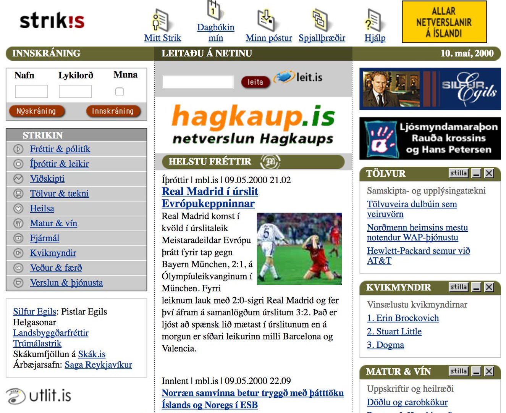
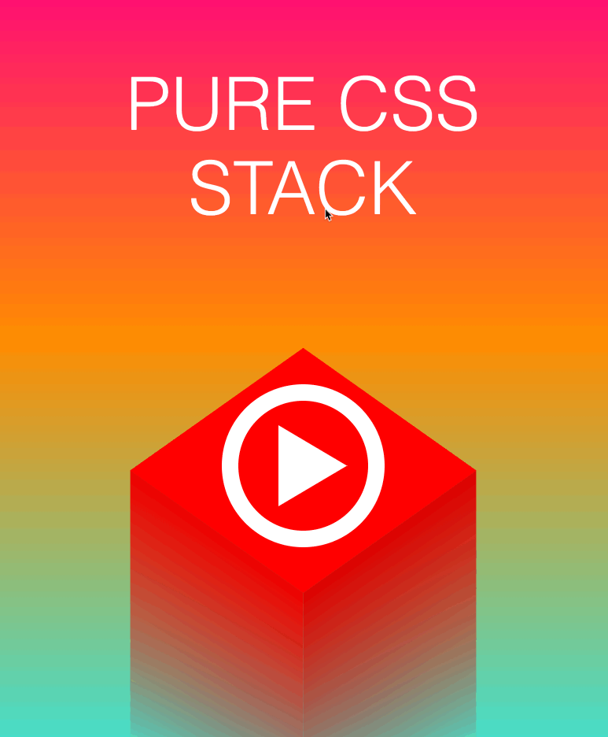

# Fyrirlestur 3.1 — CSS #1 – Málfræði

## Vefforritun 1 — TÖL107G

### Ólafur Sverrir Kjartansson, [osk@hi.is](mailto:osk@hi.is)

---

## Hvað er CSS?

* [Cascading Style Sheets](http://en.wikipedia.org/wiki/Cascading_Style_Sheets)
* CSS er style sheet language sem lýsir framsetningu á skjali skrifuðu í markup language, t.d. HTML, XHTML, XML og SVG
* Hannað til að aðskilja efni frá útliti

***

## Fyrir tíma CSS…

* Töflur og gegnsæjar gif myndir
* `<FONT>`
* Merking og útlit í einni sæng

***



***

## Sagan

* CSS 1 árið 1996
* CSS 2 árið 1998
* Fyrstu árin lítill og ósamhæfður stuðningur í vöfrum
* [Web Standards Project (WaSP)](http://en.wikipedia.org/wiki/Web_Standards_Project) stofnað til að þrýsta á vafraframleiðendur

***

## Upprunalega acid prófið


***

## Töflulaus hönnun

* Á árunum 2001-2003 fór hlutirnar að gerast
* Wired og ESPN endurhönnuð með CSS árið 2003
* [CSS Zen Garden](http://www.csszengarden.com/) sýndi fram á kraft CSS

---

## Specification

* Staðlað af W3C
* [CSS 2.1 W3C recommendation 2011](http://www.w3.org/TR/CSS2/) þó fyrst árið 2004
* CSS level 3 (CSS3) – unnið sem [_módular_](https://www.w3.org/Style/CSS/current-work) ofan á fyrri útgáfur

***

* CSS 3 eru allar viðbætur og breytingar á CSS eftir CSS 2.1, köllum allt saman einfaldlega _CSS_
* Verður ekkert CSS4

***


---

> “You don't need to be a programmer or a CS major to understand the CSS specifications. You don't need to be over 18 or have a Bachelor's degree. You just need to be very pedantic, very persistent, and very thorough.”
- [Understanding the CSS Specifications](http://www.w3.org/Style/CSS/read)

***


***

> Using CSS for presentation is materially honest—that’s the intended use of CSS. It also allows HTML to be materially honest.
- [Resilient Web Design – Chapter 2](https://resilientwebdesign.com/chapter2/)

***


***

> Think for a moment of all the sites out there on the web. There’s a huge variation in visual style: colour schemes, typographic treatments, textures and layouts. All of that variety is made possible by one simple pattern that describes all the CSS ever written: `selector { property: value; }`
>  That’s it.
- [Resilient Web Design – Chapter 2](https://resilientwebdesign.com/chapter2/)

***

## CSS er einfalt, ekki auðvelt

* Mjög einföld málfræði í grunninn
* Verður hratt flókið, búið ykkur undir það
  - Verið óhrædd við að spyrja
* Þolinmæði og ákveðni hjálpa 💪😤

***

## CSS er einfalt, en kröftugt

* Þrátt fyrir einfalda málfræði í grunninn er CSS mjög kröftugt
* Flest þau útlit sem við sjáum á vefnum eru smíðuð með CSS
* Þið getið smíðað þau líka!

***

[](https://codepen.io/finnhvman/full/xJRMJp/)

***

[](https://github.com/cyanharlow/purecss-francine)

---

## Tenging við html

Í æskilegri röð:

1. Vísa í skrá (`.css` ending): `<link rel="stylesheet" href="...">` í `<head>` – viðhöldum algjörum aðskilnaði
2. `<style>` blokk í HTML skjali, helst í `<head>` – ekki alveg jafn hreint en aðskiljum þó frá markup
3. `style` attribute á element – *alls ekki* æskilegt þar sem við erum að binda útlit við element í markup

***

[Dæmi um allar þrjár leiðir](daemi/html-css.html)

[Dæmi þar sem búið er að færa allt CSS í skrá](daemi/html-css2.html)

***

## Refactor

* Í seinna dæminu erum við búin að _refactora_ fyrra dæmið
* Breyttum uppbygginu kóðans til hins betra án þess breyta lokaniðurstöðunni

---

## Málfræði

* Vinnum með _reglusett_, samanstendur af
  - _selectors_
  - _skilgreiningum_
* Athugasemdir eru innan `/* comment */`

***

```css
p {
  color: green;
  margin: 1em;
}
/* þetta er athugasemd */
```

***

## Selectors

* Strengur sem lýsir því hvaða element við viljum að taki við _skilgreiningum_
  - Skiptast í sex flokka
* Getum tengt saman
  - Fjórar gerðir af samtengingum

***

## Selectors – flokkar

1. _Type selector_, heiti á elementi, t.d. `p`
2. _Universal selector_, öll element, `*`
3. _Attribute selector_, velur element eftir attribute og innihaldi

***

## Selectors – flokkar

4. _Class selector_, velur element eftir því hvað `class` attribute inniheldur, notar `.` (punkt)
5. _ID selector_, velur element eftir því hvað `id` attribute inniheldur
6. _Gervi-klasar_ (pseudo-classes), velur hluti sem ekki er hægt að velja með hinum, notum `:`

***

## Gervi-klasar (pseudo-classes)

* Dýnamískir gerviklasar
  - Fyrir tengla `:link` ef ekki er búið að heimsækja og `:visited` ef búið er að heimsækja
  - Fyrir aðgerðir notenda, `:hover` meðan sveimað er yfir element, `:active` ef búið er að velja það eða smella á það, `:focus` ef það hefur fókus

***

* Gerviklasar fyrir upbyggingu
  - t.d. `:nth-child()`, `:first-child` eða `:last-of-type`

***

## Selectors – samtenging

* `" "` (bil) þýðir að seinni selector velur element sem er afkomandi fyrri
* `>` er fyrir _strangt barn_, seinni selector verður að vera barna fyrri
* `+` er fyrir _systkini_, seinni selector velur element sem er systkini sem kemur **beint á eftir** fyrri selector
* `~` er almennur systkina selector, seinni selector velur element sem er syskini fyrri

***

[Dæmi um selectors](daemi/selectors.html)

***

## `at` reglur

* Leyfa skilgreiningar á aukaupplýsingum
* Ákveðið gildi, t.d.
  - `@import 'foo.css';` innifelur skrá

***

* Hreiðruð gildi, t.d.
  - `@media` sem skilgreinir að ákveðnar reglur eigi við ákveðna eftir _media query_
  - `@supports` er nýleg regla sem leyfir okkur að innifelda reglur aðeins ef ákveðin CSS virkni er studd

***

## Gervi-element (pseudo-element)

Gervi-element leyfa okkur að velja parta af elementi sem við annars gætum ekki gert. Þau eru skilgreind í selector með `::`.

* `::before/::after` – element sem er fyrir framan/aftan það sem skilgreint er
* `::first-letter` – fyrsti stafur elements
* `::first-line` – fyrsta lína elements

***

## Villumeðhöndlun

* CSS er hannað til að fyrirgefa minniháttar villur, t.d. fyrir
  - Ef tvípunkt eða semíkommu vantar í yfirlýsingu
  - Ef heiti eigindis er óþekkt er yfirlýsingin öll hunsuð og haldið áfram að næstu.

***

* Meiriháttar villur stoppa lestur á skjali frá þeim stað sem þær eiga sér stað

[Dæmi um villumeðhöndlun](daemi/error.html)

***

## Yfirlýsingar

* Reglusett inniheldur yfirlýsingar:
  - `eigindi: gildi;`
* Mjög mörg eigindi, möguleg gildi færri

***

## Shorthand

* Oft er hægt að skilgreina í einni yfirlýsingu mörg gildi fyrir svipaða virkni
* Sparar tíma, línur, og getur gert CSS lesanlegra

`margin: <top> <right> <bottom> <left>;`

***

## Gildi – strengir

* Strengir eru skilgreindir með `"` eða `'`
  - `"this is a 'string'"`
  - `'this is a "string"'`
* Getum notað viðeigandi staf með `\` fyrir framan
  - `"this is a \"string\""`

***

## Gildi – URL

Url skilgreinum við með `url(<slóð>)` þar sem slóð er bein slóð eða slóð í streng.

* `url(http://example.org)`
* `url('http://example.org')`

***

## Gildi – litir

* Lykilorði, t.d. `black`, `white`, `green`
  - `transparent` er einnig lykilorð fyrir alveg gegnsæan lit
* RGB gildi með hexadecimal eða `rgb()`,
  - t.d. `#00ff00` eða `rgb(0, 255, 0)` (bæði gildi eru grænn).
* [HSL](https://en.wikipedia.org/wiki/HSL_and_HSV) gildi með `hsl()`

***

## Gildi – tölur

* Heiltölur
* Rauntölur, með punkt `1.2`
* Prósentur `25.5%`

***

[Dæmi um gildi](daemi/values.html)
