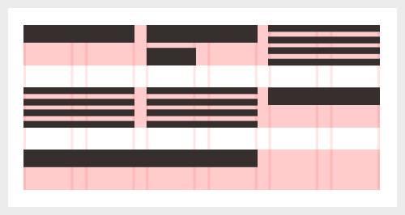

# Fyrirlestur 3.2 — CSS #1 – Cascade

## Vefforritun 1 — TÖL107G

### Ólafur Sverrir Kjartansson, [osk@hi.is](mailto:osk@hi.is)

---

## Lengdir

* Nákvæmar einingar
  - t.d. `in`, `cm`
  - Notum mest `px` eða _pixel_
* Hlutfallslegar einingar
* `auto` leyfir vafra að reikna lengdina

***

## Hlutfallslegar einingar

* Letur-hlutfallslegar einingar (font-relative lengths)
* Skjá-prósentu einingar (viewport percentage lengths)

***

## Letur-hlutfallslegar einingar

* Horfa til `font-size` eigindsins
* Yfirleitt `em` eða `rem`
* Í grunninn er `1em == 16px` en getum breytt með að setja `font-size` á `html`

***

* Þegar reiknað er úr `em` gildum í elementum sem eiga sér foreldri með skilgreint `em` gildi eru þau _margfölduð_.
* Á ekki við `rem`

[Dæmi um letur-hlutfallslegar einingar](daemi/em.html)

***



[Dæmi um „vertical rhythm“](daemi/vertical-rhythm.html)

***

## Skjá-prósentu einingar

* Hlutfallslegar við stærð _viewports_ sem er yfirleitt stærð vafragluggans.
* `vw` er ein eining á breiddina (_viewport width_) svo `100vw` myndi fylla upp í skjá á breiddina
* `vh` er ein eining á hæðina (_viewport height_) svo `100vh` myndi fylla upp í skjá á hæðina

***

* `1vmin` er `1vw` eða `1vh`, hvort sem er minna
* `1vmax` er `1vw` eða `1vh`, hvort sem er stærra

[Dæmi um skjá-prósentu einingar](daemi/vh-vw.html)

---

## Að teikna útlit

* Hvernig veit vafri hvaða gildi fyrir hvaða eigindi eigi að nota?
* Reglur og reiknirit
* _specificity_ og _cascade_

***

## Specificity – sértækni

* „Tala“ á forminu `a,b,c,d`
* `a`, 1 ef skilgreint í `style` attribute, annars 0
* `b`, fjöldi `id` selectora
* `c`, fjöldi attribute selectora og gervi-klasa
* `d`, fjöldi elementa og gervi-elementa
* Síðan skeytt saman í tölu sem er _sértækni_

***

## Specificity – dæmi

```css
li.foo {}        /* a=0 b=0 c=1 d=1 → 11 */
```

```css
#foo {}          /* a=0 b=1 c=0 d=0 → 100 */
```

```css
.foo .bar:active /* a=0 b=0 c=3 d=0 → 30 */
```

```html
style=""         /* a=1 b=0 c=0 d=0 → 1000 */
```

***

## Cascade – „flóðið“

* Þegar útlit er birt þarf að komast að því _nákvæmlega_ hvaða skilgreiningar eigi við hvert element
* Allar skilgreiningar fyrir element fundnar og raðað

***

Skilgreiningar geta komið frá þremur stöðum:

* _User agent_, sjálfgefnir stílar frá tæki sem birtir
* _Notanda_, notandi tækis, t.d. að allt sé stækkað
* _Höfundi_, skilgreiningar frá höfundi vefs

***

## Röðun

1. Skilgreiningum user agents
2. Skilgreiningum notanda
3. Skilgreiningum höfundar
4. Skilgreiningum höfundar merktar með `!important`
5. Skilgreiningum notanda merktar með `!important`
6. Sértækni
7. Röð innan skjals, seinna skilgreint fær forgang

***

## `!important`

* Getum ýtt skilgreiningu upp listann með `!important`
* Hunsar sértækni
* Ekki góð hugmynd

***

```css
div {
  font-size: 100px !important;
  /* það er mjög mikilvægt að
     allur texti sé 100px! */
}
```

***

## Gildi reiknuð

* Höfum núna þær reglur sem við notum fyrir hvert element, getum fundið skilgreint gildi fyrir hvert eigindi
  - Ef „flóðið“ gefur okkur gildi, notum það
  - Annars, erft gildi
  - Annars, upphafsgildi

***

## Erfð gildi

Sum gildi erfast frá foreldri til barns.

```html
<h1>Halló <em>heimur</em></h1>
```

```css
h1 { color: blue; }
/*
  allur texti innan h1 er blár, líka sá
  sem er innan em, þar sem color erfist
*/
```

***

## Upphafsgildi

* Fyrir aðrar yfirlýsingar eru skilgreind upphafsgildi
* Yfirleitt rökrétt en stundum geta þau valdið okkur vandræðum, sérstaklega með _shorthand_
* T.d. er `background-color` með sjálfgefna gildið `transparent`, engin bakgrunnslitur

***

* Reiknað gildi – reiknað úr hlutfallslegum gildum eins langt og hægt er, t.d. hlutfallsleg breidd m.v. foreldri
* Notað gildi – fáum nákvæm gildi úr öllum, leyst úr háðum gildum
* Raun gildi – gildi notað við birtingu, t.d. þarf að námunda tölur að einhverjum aukastaf

[Dæmi](daemi/values.html)

---

## Reset

* Hver vafri stillir sitt user agent stylesheet
* Viljum oft hafa hreinan grunn
* CSS reset setur öll element í „núllstöðu“
* [CSS Tools: Reset CSS](http://meyerweb.com/eric/tools/css/reset/)

[Dæmi um reset](daemi/reset.html)

---

## Að skrifa CSS

* Notum ekki `id` í selectorum
  - Hátt specificity, getur valdið vandræðum
  - Ekki endurnýtanlegt - aðeins eitt id per síðu
* Nýtum „flóðið“ til að minnka endurtekningar
  - T.d. [ekki skilgreina leturgerð aftur og aftur](daemi/cascade-font.html)

***

* Góð og snyrtileg heiti á klössum
  - Enska, kebab-case

```css
/* ekki svona */
.MikilvaegurTexti { }
.ListOfItems { }

/* heldur svona */
.important-text { }
.list-of-items { }
```

***

## Samsett orð í forritun

* _Kebab-case_ er ein af nokkrum leiðum til að skrifa samsett orð án bila
* Þurfum oft að gera það þegar bil hefur merkingu
* Aðrar leiðir t.d. `lowerCamelCase` og `snake_case`
* Ættum að huga að í kóðastíl og gæta samræmis

***

## Validation

* W3C heldur úti [_validation_ þjónustu](https://jigsaw.w3.org/css-validator/)
* Bæði villur og viðvaranir
  - Til þess að fá allar upplýsingar þurfum við að kveikja á öllum _warnings_ undir _more options_
