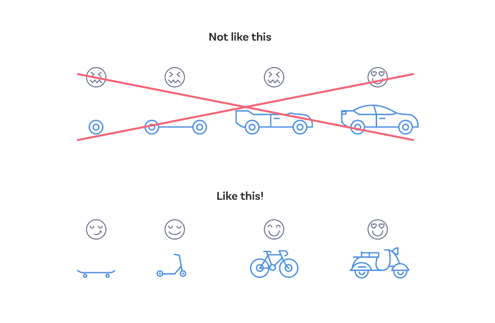

# Fyrirlestur 4.2 — CSS #2 – Stuðningur við CSS

## Vefforritun 1 — TÖL107G

### Ólafur Sverrir Kjartansson, [osk@hi.is](mailto:osk@hi.is)

---

## Progressive enhancement

* Upplifun sem krefst minnstu mögulegrar tækni
* Bætum virkni við eins og stuðningur er til staðar
* Byrjum einfalt og bætum við virkni í lögum

***

1. Skrifum áhugavert, skýrt efni
2. Setjum það upp með aðgengilegu, merkingarfræðilegu HTML
3. Bætum við grunn útliti sem er vel stutt
4. Bætum við flóknara útliti sem er e.t.v. minna stutt
5. Bætum við aukinni virkni með JavaScript

***



***

## Fallback

* Ný eigindi eða gildi leyfa okkur að gera eitthvað skemmtilegt
* En hvað ef það eru ekki allir vafrar farnir að styðja eigindið? 😩
* Skilgreinum _fallback_ gildi sem við erum nokkuð viss um að sé stutt

***

```css
width: 99%;
width: calc(100% - 30px);
```

***

## calc

* `calc()` er fall sem leyfir reikninga með mismumandi einingar
* `calc(50% - 2px);`, `2px` dregnir frá `50%` þegar notað gildi er fundið

***

## Vafraforskeyti

* Meðan vafri er ekki með fullkominn stuðning við staðal eru vafraforskeyti (vendor prefixes) oft notuð til að bjóða upp á stuðning.
* Lítið notað á nýrri virkni en enn til staðar fyrir nýlega virkni
* Æskilegt að nota sjálfvirk tól til að sjá um, t.d. [_autoprefixer_](https://autoprefixer.github.io/)

***

```css
display: -webkit-box;
display: -ms-flexbox;
display: flex;

-webkit-user-select: none;
-moz-user-select: none;
-ms-user-select: none;
user-select: none;
```

***

## Hvað getum við notað?

* Hvaða vafrar styðja hvað af CSS?
* [caniuse.com](http://caniuse.com/) hefur yfirgripsmikinn gagnagrunn yfir stuðning vafra á ákveðinni virkni

***

## _Feature queries_

* Nýleg leið til að athuga hvort vafri styðji eigindi og gildi
* Hreiðraðar CSS reglur eru notaðar ef stuðningur fyrir hendi
* Notum fyrir nýja virkni sem þarf meira en bara fallback gildi

***

```css
@supports (writing-mode: vertical-lr) {
  h1 {
    float: left;
    writing-mode: vertical-lr;
  }
  /* ef vafri styður writing-mode er h1 lóðrétt vinstra megin */
}
```

***

## Shim & polyfill

* Shim (eða shiv) er virkni sem „stungið“ er inn og veitir virkni frá nýju API í gömlu umhverfi
* Polyfill er kóði eða plugin sem veitir þér aðgang að virkni sem þú gerir ráð fyrir að vafrinn bjóði upp á. Þ.e.a.s. shim fyrir vafra API
* [HTML5 Cross Browser Polyfills](https://github.com/Modernizr/Modernizr/wiki/HTML5-Cross-Browser-Polyfills)

***

## Að skrifa CSS

* Notum _í dag_ virkni sem verður ekki að fullu studd í öllum vöfrum fyrr en _í framtíðinni_
* Ákveðum hvaða vafra og stýrikerfi við ætlum (eða ætlum ekki að styðja)
* Prófum í viðeigandi tækjum
* Nýtum okkur _progressive enhancement_

***

## Prófanir í öllum vöfrum

* Við forritum vefina okkar yfirleitt í uppáhalds vafranum okkar
  - Góð _developer tools_ skipta miklu máli
* Ekki allar vafrir standa jafnfætis
  - Mismunandi stuðningur og mismunandi böggar

***

## Fyrsta skrefið er að vera með plan

* Hvaða vafra ætlum við að styðja?
  - [IE með 1,8% markaðshlutdeild á Íslandi og 3% hnattrænt](http://gs.statcounter.com/browser-market-share/all/worldwide/2018)?
* Getum athugað væntan notendahóp eða skoðað heimsóknartölur
* Gott að hafa aðgang í alvöru tæki en líka til þjónustur eins og [Browserstack](https://www.browserstack.com/)
