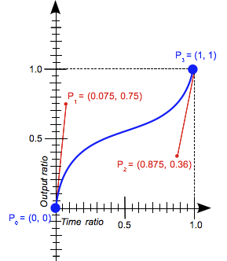

# Fyrirlestur 6.2 – Kvikun
### Vefforritun 1 — TÖL107G
#### Ólafur Sverrir Kjartansson, [osk@hi.is](mailto:osk@hi.is)

---

## Kvikun

* Kvikun (animation) er þegar við látum eitthvað hreyfast eftir ákveðnum reglum
* Í CSS er hægt að gera það með `transition` og `animation` eigindunum

***

## Umskipti (transition)

* Látum eitt gildi breytast í annað á skilgreindum tíma
* Brúað á milli upphafs- og endagildis

***

* Skilgreinum:
  - Hvaða eigindi breytist
  - Á hve löngum tíma
  - Með hvaða hröðun
  - Hvort það sé töf

***

## Dæmi

```
/*
transition:
<prop> <duration> <timing-function> <delay>
*/
transition: color 250ms linear 0;
```

[Dæmi](daemi/animation/transition.html)

***

## Umskipti

* Getum skilgreint fleiri en eitt eigindi með því að skipta með kommu: `,`
* Getum skilgreint `all` en það breytir _öllum_ eigindum, getur valdið hægagangi og ættum ekki að gera

***

## Hröðun

* Hröðunarfall er skilgreint með _rúmfræðilegri bezier kúrvu_ (cubic bezier curve)
* eða lykilorði sem tengt er ákveðinni bezier kúrvu

***

## Bezier kúrvur



***

## Hröðunar lykilorð

* `linear`, hröðun er línuleg
* `ease`, sjálfgefið gildi fyrir þau eigindi sem nota hröðun, mikil hröðun í byrjun, hægir síðan á sér og kemur rólega í mark

***

* `ease-in`, byrjar hægt en eykur hröðun eftir því sem endi nálgast
* `ease-in-out`, byrjar hægt, eykur hraða en hægir aftur á sér þegar endi nálgast
* `ease-out`, byrjar hratt en hægir á sér þegar endi nálgast

***


Línuleg hröðun með linear lykilorði.

***


Hröðun með ease-in-out lykilorði.

***

[Dæmi um hröðunarföll](daemi/animation/timing.html)

***

## Animation

* Með `animation` eigindinu getum við útbúið flóknari hreyfingar án þess að nota JavaScript
* Skilgreinum _keyframes_ fyrir hreyfinguna með `@keyframes` at-reglunni

***

* Lykilorð (`from`, `to`) eða prósentugildi sem „selectorar“ innan keyframes
* Gildin segja til um hvernig hreyfing lítur út á viðeigandi stað og mun vafri brúa á milli m.v. gefinn tíma og hröðun

***

```css
@keyframes fade {
  /* hreyfing í 0% => opacity: 0 */
  from { opacity: 1; }

  /* hreyfing í 50% => opacity: 0.4 */
  50% { opacity: 0.4; }

  /* hreyfing í 100% => opacity: 1 */
  to { opacity: 0; }
}
```

***

## Animation

* Stýrum með `animation` shorthand eða viðgeigandi gildum

```
/* animation: duration | name | timing */
animation: 3s fade ease-in;
```

[Dæmi](daemi/animation/animation.html)

[Dæmi](daemi/animation/animation2.html)

***

## Transform

* Með `transform` eigindinu getum við gert breytingar á tvívíðu og þrívíðu rúmi hluta
  - `translate`, `rotate`, `skew` og `scale`
* Lang flestar af þessum aðgerðum verða fluttar af vafra frá _CPU_ yfir á _GPU_
* **Miklu** hagkvæmari en að reikna út gildi og teikna allt útlit vefs aftur ef við myndum t.d. nota `position`

***

## Transforms

* `transform: translateY(-100px);`
* `transform: rotate(90deg);`
* `transform: scale(1.2);`
* og margt fleira...

[Dæmi](daemi/animation/transform.html)

***

## Dæmi

* [Animation og transform](daemi/animation/pulse.html)
* [Einföld „hamborgara“ valmynd](daemi/animation/hamburger.html)

***

## Jank

* 60 rammar á sekúndu er galdratalan, allt lítur út fyrir að vera _silki mjúkt_
  - Höfum 16,67ms per ramma
* Höldum okkur við hluti sem er ódýrt og hagstætt að hreyfa

***

* Þegar vafrinn eyðir of miklum tíma í að teikna förum við hratt yfir 16,67ms per ramma
* Ef við förum undir 60 fps eða 30 fps, förum við að taka eftir _jank_, hlutir hreyfast óeðlilega

***

**Aðeins breyta `opacity` og `transform` þegar við hreyfum hluti til að halda 60fps**

***

<iframe width="1280" height="720" src="https://www.youtube.com/embed/-62uPWUxgcg" frameborder="0" allowfullscreen></iframe>

***

## Að nota hreyfingar

* Með því að nota hreyfingar getum við gert viðmót eðlilegra, vinalegra og skemmtilegra
* Notum sparsamlega og með ásetning, ekki láta _allt_ hreyfast _alltaf_
* Viðmót verða _fágaðari_ og ekki eins _gróf_
* [Material Design – Understanding motion](https://material.io/design/motion/#principles) er góður inngangur að _motion design_
