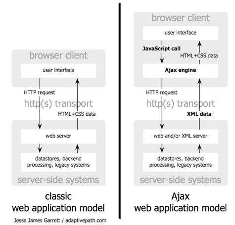

# Fyrirlestur 11.2 – Ajax

## Vefforritun 1 — TÖL107G

### Ólafur Sverrir Kjartansson, [osk@hi.is](mailto:osk@hi.is)

---

## JSON

* JavaScript Object Notation
* Létt gagna format sem er auðvelt að lesa og skrifa, bæði fyrir menn og vélar
* Byggir á almennum gagnastrúktúrum
  - Heiti/gildi pörum (objects, dictionary, hash table o.s.fr.)
  - Röðuðum listum (array, vector o.s.fr.)

***

## Munur á JSON og JS hlutum

* Lyklar verða að vera strengir, vegna frátekinna orða
* Strengir verða að vera skilgreindir með `"`, ekki `'`
* Takmarkanir á tölum, t.d. hex form ekki leyft (`0xea`)
* Búið að takmarka týpur, t.d. ekki `undefined` eða `RegExp`

***

## JSON dæmi

```json
{
  "firstName": "John",
  "lastName": "Smith",
  "isAlive": true,
  "age": 25,
  "address": {
    "streetAddress": "21 2nd Street",
    "city": "New York",
    "state": "NY",
    "postalCode": "10021-3100"
  }
}
```

***

## JSON útfærslur

* Höfum `JSON` hlut í vöfrum, node.js og í fleiri umhverfum gegnum forritasöfn
* `stringify` – breytir gagnahlut í JSON streng
* `parse` – breytir JSON streng í gagnahlut
  - Ef við reynum að breyta ólöglegum streng fáum við exception

***

<!-- eslint-disable no-unused-vars -->

```javascript
const obj = {
  a: 1,
  string: 'Halló, heimur',
  obj: {
    b: 'foo',
    c: [1, 2, 3],
  },
};
const json = JSON.stringify(obj);
const back = JSON.parse(json);
```

***

```javascript
try {
  JSON.parse('{');
} catch (e) {
  console.log(e);
}

// SyntaxError: Unexpected end of JSON input
```

---

## Ajax

* _Asynchronous JavaScript and XML_
* Skilgreint 2005
  - [Ajax: A New Approach to Web Applications](http://adaptivepath.org/ideas/ajax-new-approach-web-applications/)
* Í dag ekki ein tækni heldur hugtakið að sækja gögn ósamstillt (async) til að koma í veg fyrir að hlaða allri síðunni aftur

***



***

## XMLHttpRequest

* `XMLHttpRequest` hluturinn getur framkvæmt ajax beiðnir
  - Fyrst skilgreindur í IE5!
* Útbúum beiðni og sendum á vefþjón

***

* Fáum atburð þegar lokið eða þegar villa kemur upp
* Sækjum efni yfir HTTP
* Gerist ekki strax, þurfum að gera ráð fyrir því

***

```javascript
const r = new XMLHttpRequest();

// Sækjum slóð með GET              async
r.open('GET', 'http://example.org', true);

// Fall sem keyrir við svar frá vefþjón
// r mun innihalda gögn um HTTP kall
r.onload = () => {
  if (r.status >= 200 && r.status < 400) {
    console.log(r.response);
  } else {
    console.log('villa!', r);
  }
};
```

***

<!-- eslint-disable no-undef -->

```javascript
// Fall sem keyrir ef villa kemur upp
r.onerror = () => {
  console.log('villa í tengingu');
};

// Senda af stað -- verðum að kalla í þetta!
r.send();
```

***

## apis.is

* Notum dæmi frá [apis.is](http://apis.is) til að gera ajax beiðnir
  - Github: https://github.com/apis-is/apis
* Hjúpa eitthvað af gögnum frá íslenskum aðilum í vefþjónustur
* Hafa CORS headera og leyfa öllum að sækja gögn

---

## Same-origin og CORS

* Same-origin policy segir til um að ekki megi hlaða gögnum frá annari síðu nema protocol, port og host sé það sama
* Megum þó vísa í og nota JavaScript, CSS, myndir o.fl.

***

* `https://foo.example.org/` má...
  - sækja `https://foo.example.org/data.json`
  - ekki sækja `http://bar.example.org/data.json`

[MDN: Same-origin policy](https://developer.mozilla.org/en-US/docs/Web/Security/Same-origin_policy)

***

## Cross-origin resource sharing (CORS)

* Þar sem same-origin policy bannar sjálfgefið að sækja gögn _cross-origin_ þurfum við leið til að geta sótt gögn á milli þjóna
* CORS skilgreinir leið til að leyfa það

***

* Setjum _headera_ í HTTP svör sem segja til um hvað má
  - `Access-Control-Allow-Origin: http://example.com` eða `*`
  - `Access-Control-Allow-Methods: GET`

---

## `fetch`

* [`fetch`](https://developer.mozilla.org/en-US/docs/Web/API/Fetch_API) er nýlegt API til að eiga ajax samskipti
* Mun þægilegra API sem notar _promises_

***

## fetch notkun

* Búum til request, einfaldasta leiðin er einfaldlega `fetch(url)` sem framkvæmir `GET` á `url` og skilar Promise
* Getum líka sent inn `options` hlut sem annað viðfang og gert þá t.d. `POST`
* Fáum til baka `response` hlut sem við athugum `status` á eða hvort `response.ok` sé `true` (ef status er 200–299)

***

* Eftir að við fáum response þurfum við að ákveða hvernig við fáum gögnin
  - `JSON` með `response.json()`
  - Texta `response.text()`
  - Binary gögn `response.blob()`
* Skilar allt Promise

***

```javascript
fetch('url')
  .then((result) => {
    if (!result.ok) {
      throw new Error('Non 200 status');
    }
    return result.json();
  })
  .then(data => console.log(data))
  .catch(error => console.error(error));
```

***

eða með `async await`

<!-- eslint-disable no-unused-vars -->

```javascript
async function fetchData() {
  const result = await fetch('url');

  if (result.status !== 200) {
    console.error('Non 200 status');
  } else {
    const data = await result.json();
    console.log(data);
  }
}
```

***

```javascript
const options = {
  body: { /* object af post data */ },
  cache: '', /* cache header */
  headers: { /* auka headers */ },
  method: 'POST',
};

fetch('url', options);
```
