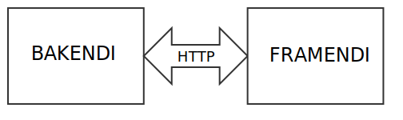

# Fyrirlestur 13.1 – HTML upprifjun

## Vefforritun 1 — TÖL107G

### Ólafur Sverrir Kjartansson, [osk@hi.is](mailto:osk@hi.is)

---

## Grunnhugtök

* Vefurinn
* Vefsíða
* Vefþjónn
* Vafri
* Vefforrit

***

## Framendi VS bakendi



***

## CLI

* _Command-line interface_
* Texta viðmót á forrit, ólíkt _grafísku_ viðmóti
* Skrifum skipanir, keyrum forrit og fáum texta niðurstöðu
* `cmd` á Windows, `Terminal` á Mac/Linux

***

## Textaritlar

* Forrit sem leyfa okkur að vinna með texta
* Mjög einfaldir yfir í mjög flókna
  - Notepad yfir í Vim
* Getum sótt viðbætur og stillt flest allt í nýrri textaritlum

***

## Stafasett

* Þegar við vinnum með texta þurfum við að skilgreina í hvaða _stafasetti_ textinn er
* Skilgreinir hvernig hver stafur er kóðaður og hve mikið pláss hann tekur
  - [ASCII](https://en.wikipedia.org/wiki/ASCII) gerir ráð fyrir 8 bitum fyrir hvern staf

***

## utf-8

* Við munum eingöngu nota [`utf-8`](https://en.wikipedia.org/wiki/UTF-8) stafasettið
  - Notar allt að fjögur byte til að skilgreina staf eða tákn ✨
  - Hannað til að virka með ASCII
* Getur kóðað alla stafi í [Unicode](http://unicode.org/) og því langflesta þá stafi sem við þurfum að nota

***

## FTP

* Þegar við klárum þróun viljum við gera aðgengilegt á vefnum
* _FTP_ (File Transfer Protocol) eða SFTP
* Opnum skrárkerfi vefþjóns og leyfir okkur að færa skrár á milli

---

## HyperText

* Hugtak um ólínulegan texta sem er tengdur við annan texta og hægt er að nálgast strax
* Skilgreint af [Ted Nelson](https://en.wikipedia.org/wiki/Ted_Nelson) 1963
  - Innblásið af t.d. Vennevar Bush í greininni [„As We May Think“](http://www.theatlantic.com/magazine/archive/1945/07/as-we-may-think/303881/?single_page=true) árið 1945
* „Veldu þitt eigið ævintýri“ bækur útfæra á hliðstæðan máta

***

## Markup Language

* Á einhverjum tímapunkti þurfum við leið til að ljá texta aukna dýpt
* Markup language leyfir okkur það
* Lýsing á skjali sem er setningarfræðilega aðgreind frá texta skjalsins

***

* Lightweight – Einföld setningarfræði sem eykur læsileiki fyrir fólk
* Presentational – WYSIWYG ritlar, markup falið fyrir notanda, t.d. Word

***

* Procedural – markup innifalið í texta sem leiðbeiningar um aðgerðir á textann, t.d. LaTeX
* Descriptive – markup gefur texta merkingu sem er óháður birtingu þess, t.d. HTML

***

## HTML

* HyperText Markup Language
* Kom fyrst fram á sjónarsviðið 1993, þróað af Tim Berners-Lee
* Útgáfur 1.0–4.01 byggðar á SGML
* Seinni útgáfur, XHTML og HTML5

***

## W3C

* Stofnað af Tim Berners-Lee til að vinna að framþróun vefsins
* Sér um staðla og stöðlun á ýmsu tengdum vefnum
  - HTML, CSS en _ekki_ JavaScript
* Óháð samtök

***

> The primary design principle underlying the Web’s usefulness and growth is universality. […] And it should be accessible from any kind of hardware that can connect to the Internet: stationary or mobile, small screen or large.

* Tim Berners-Lee: [Long Live the Web](http://www.scientificamerican.com/article.cfm?id=long-live-the-web) á 20 ára afmæli vefsins.

***

## Afhverju DocType í dag?

* Arfleið frá eldri tíma, segir til um hvort vafri eigi að nota _standards mode_ eða _quirks mode_
* Ef ekkert DOCTYPE þá er quirks mode notað – vafri gerir ráð fyrir að síðan noti eldri, úrelta tækni til að birta síðu
* Ef DOCTYPE bendir á rétt, staðlað DTD er standards mode notað

***

## XHTML

* Extensible HyperText Markup Language
* Tilraun til að láta HTML vera betur skilgreint og þá sem framlenging af XML en ekki SGML
* Vel formað XML svo hægt að þátta (parse) með XML þátturum
* Gekk ekki vel

***

## Gallar við XHTML

* Þar sem XHTML á að vera vel formað XML er auðvelt að gera mistök sem valda því að síða birtist ekki, t.d. að loka ekki elementi
* Villur í vöfrum stoppuðu notkun
* Flest XHTML var sent frá vefþjóni merkt sem HTML (Content type sett sem `text/html`) og því túlkað sem slíkt

***

## HTML5

* HTML5 byggir ekki á SGML en er samhæft fyrri útgáfum (backwards compatible)
* Stefnan að auka samvirkni (interoperability) og aðgengi að vefnum
* Brösótt saga, en skilgreint sem fimmta útgáfa HTML í október 2014

***

## Elements

* Einstakur hluti af vefsíðu og býr til tré með öðrum hlutum
* Inniheldur önnur element eða texta nóðu
* Hvert element táknar merkingu, er _semantic_
* `<p>Halló heimur</p>` er element sem skilgreinir setningu (paragraph) með texta nóðuna _„Halló heimur“_

***

## Tags

* Element byrja á tagi, t.d. `<p>`
* Element þurfa ekki, en ættu, að enda á loka tagi, t.d. `</p>`
* Ef element hefur skilgreind _attribute_ eru þau sett á byrjunar tagið

***

* Ef element hefur aðeins byrjunar tag, getum við _sjálflokað því_ (self closing), t.d. `<br/>`
  - Þarf **ekki** í HTML5 og ættum að sleppa
* Mjög algengt að fólk geri ekki greinarmun á _element_ og _tag_, en það er munur.

***

## Attribute

* Heiti-gildis par sem breytir elementi, t.d. `<p class="foo">`
* Gildið þarf ekki að vera umlukið gæsalöppum en það er æskilegt til gildið sé skýrt
* Sum attribute þarf aðeins að skilgreina með heiti, t.d. `<option selected>`

***

## Element

HTML skilgreinir element og er þeim skipt í hópa:


***

## Að vísa í efni

* Þegar við vísum í efni þurfum við að gefa upp slóð
  - _Afstæð_ (relative) eða _nákvæm_ (absolute)
* Á við ``, `<a href="...">` og önnur element sem vísa í efni

***

## Afstæðar slóðir

* Afstæðar slóðir eða relative paths eru slóðir sem líta út frá því skjali sem vísað er frá
* Ef vísað er á `img/foo.jpg` er gert ráð fyrir að `img/` mappa sé til í sömu möppu og skjal sem vísað er frá
* Ef slóðin byrjar á `/` er byrjað á að fara „á rótina“ á viðkomandi vef

***

## Nákvæmar slóðir

* Slóðir sem vísa nákvæmlega í það sem átt er við
* Kostur að þurfa ekki að rekja sig eftir hlutfallslegri slóð, en...
* Ef einhver partur af slóð breytist mun nákvæma slóðin brotna

***

## Að skrifa HTML

* Skrifum snyrtilegt HTML
  - Fylgjum (yfirleitt) þeim kröfum sem XHTML setur á málfræði
* Pössum upp á inndráttinn
  - Whitespace er ekki mikilvægt í HTML, þ.a. mörg bil og mörgum línum er breytt í eitt bil

***

## Kóði lýsir innri manneskju

```html
<!doctype html>
<html lang="is">
  <head>
    <meta charset="utf-8">
    <title>Halló heimur</title>
  </head>
  <body>
    <p>Hæ!</p>
  </body>
</html>
```

***

```html
<!doctype html><HTML lang=is>
<head><meta charset="utf-8">
<title>Halló heimur!</TITLE>
<BODY><p>Hæ!
```

Túlkað nákvæmlega eins og fyrri kóði, en mikill munur á _lesanleika_.

***

## _Linting_

* Almennt köllum við það _linting_ að lesa yfir kóða og benda á möguleg vandamál
* Til fyrir langflest forritunarmál
* Oftast tvenns konar villur
  - Mögulegar villur við keyrslu
  - Brot á kóðastíl

***

## Merkingarfræði

* Það er sterklega mælst til þess að markup í HTML skjali sé aðeins notað til að tjá merkingu en ekki framsetningu
* Framsetning á gögnum er stýrt með CSS og fáum við því hreina skiptingu á milli efnis og útlits
* Mörg element til sem skilgreina merkingu en annars er hægt að nota attributes

***

## Af hverju merkingarfræði?

* Aðskilnaður á milli merkingar og útlits gerir manni auðveldara að breyta öðru án þess að hafa áhrif á hitt
* Einfaldar viðhald, breytingar eru dýrar
* Góð merkingarfræði getur aukið aðgengi að vef

***

* Vélar sem skoða vef með merkingarfræðilega réttu HTML geta dregið ályktanir um efnið sem getur gagnast þér og öðrum
  - T.d. Googlebot, Pocket, Instapaper
* Vafrar geta birt efni á nytsamlegan hátt sem höfundur hafði ekki dottið í hug
* Það er _snyrtilegra_ og _faglegra_

***

## `<div>` & `<span>`

* Ómerkingarbær element en notuð þegar ekkert annað _á&nbsp;við_
* `<div>` – division, skiptir síðu, _block level_, fyllir út í lárétt pláss foreldris
* `<span>` – merkir texta. Inline, fellur inn í nærliggjandi texta

***

## Aðgengi

* Aðgengi snýst ekki um að fatlað fólk geti notað vefina okkar
* Aðgengi snýst um að _fólk_ geti notað vefina okkar
* Við getum öll orðið „fötluð“ tímabundið

***

## Afhverju aðgengi?

* Viljum ekki mismuna fólki vegna fötlunar
* Getur verið mjög dýrt að gera aðgengilegt eftir á
* Samlegðaráhrif! Vefurinn okkar verður betri fyrir alla
* Lagasetningar (munu?) banna okkur að mismuna fólki á vefnum

***

## WCAG 2.0

* W3C staðall
* Listi af tilmælum og prinsippum til að gera vefi aðgengilegri
* Þrjár tegundir:
  - A, minnsta stig
  - AA, það stig sem við ættum að stefna að
  - AAA, öll skilyrði uppfyllt

***

## Lyklaborð

* Höfum allt aðgengilegt með lyklaborði
* Margir nota ekki mús eða álíka og reiða sig á lyklaborðið
* Allar upplýsingar og aðgerðir skulu aðgengilegar með lyklaborði
* Fjarlægjum ekki öll sjónræn merki um hvar fókus er
